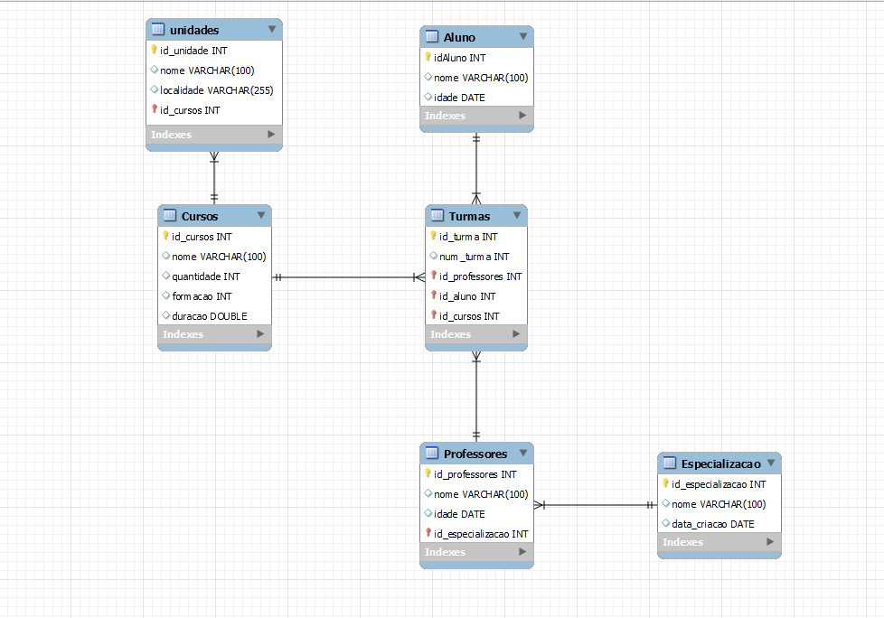

# Perguntas:

## 1- Existem outras entidades além dessas três?
R: Sim, existe outras entidades a serem representadas nesse esquema são elas: Unidades, Professores e Especialização.

## 2- Quais são os principais campos e tipos?
R: Entidade Cursos: id: int , nome: varchar, quantidade: int, formação: int  e duração: double.
R: Entidade Alunos: id: int , nome: varchar, idade: date.
R: Entidade turmas: id: int, num_turma: int, FK id_aluno: int, FK id_professor: int, FK id_curso: int.

## 3- Como essas entidades estão relacionadas?
R: Entidade Unidades recebe o id_curso da Entidade Cursos.
R: Entidade Turmas recebe o id de Cursos, Alunos, Professores.
R: Entidade Professor recebe o id da Entidade Especialização.  

    </img>

